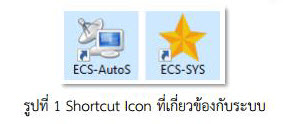
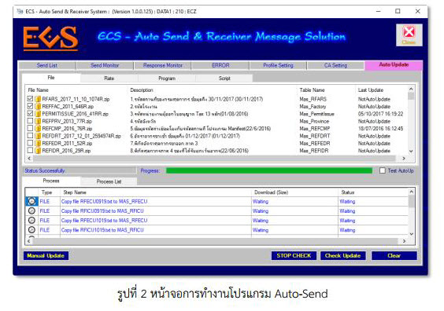
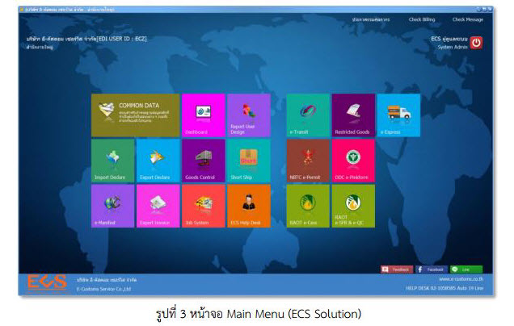
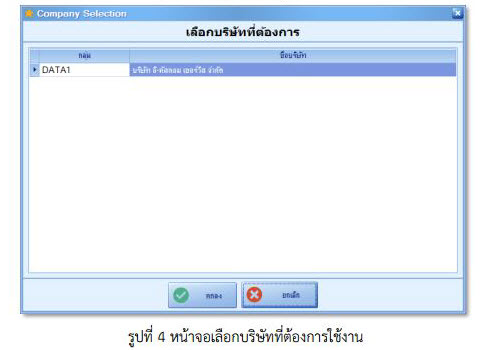
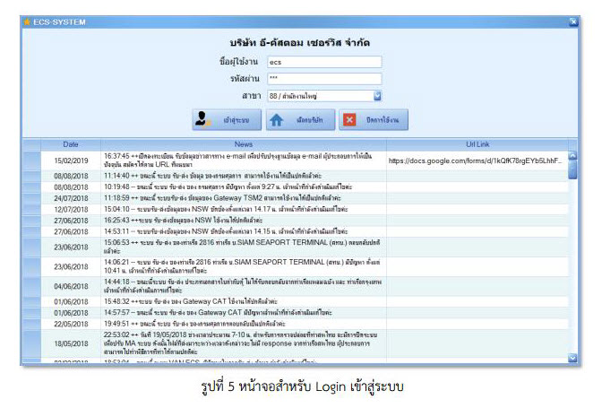
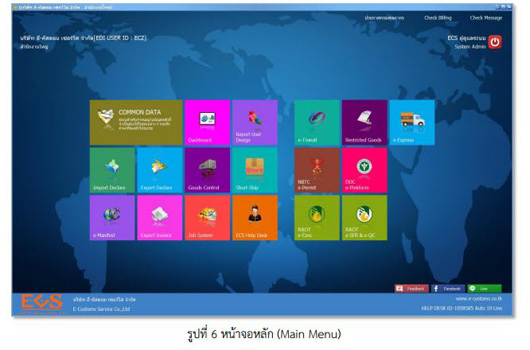
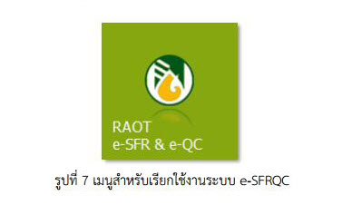

บทที่ 1  บทนำ
===

ระบบ e-SFRQC เป็นระบบสำหรับให้บริการกับผู้ประกอบการส่งยางออกฯ (ผู้นำเข้า ผู้ส่งออก/ตัวแทนออกของ/เคาน์เตอร์เซอร์วิส) ในการขอรับใบผ่านด่านศุลกากร/ใบชําระค่าธรรมเนียมการส่งยางออกฯ และการชําระเงินค่าธรรมเนียมที่เกี่ยวข้องกับการยางแห่งประเทศไทย (e-SFR) ร่วมถึงการขอรับใบรับรองคุณภาพยาง/ใบรายงานผลการทดสอบคุณภาพยาง และการชําระเงินค่าบริการ วิเคราะห์ ทดสอบยาง และผลิตภัณฑ์ยางที่เกี่ยวข้อง (e-QC)

ระบบ e-SFRQC นั้นเป็นโปรแกรมตัวหนึ่งใน Solution ECS ที่มีการใช้งานโปรแกรมส่งข้อมูลให้กับภาครัฐ (Paperless หน่วยงานกรมศุลกากร, LPI หน่วยงานอาหาร และยา ฯลฯ) โดยมีโปรแกรมที่เกี่ยวข้อง ดังนี้

- โปรแกรม Common สำหรับกำหนดค่าคงที่ระบบ และค่า Master ต่างๆ ที่ใช้ร่วมกันใน Solution ECS
- โปรแกรม Auto Send สำหรับกำหนดค่ะ Cert ,Prefix ที่ได้จากระบบ NSW ,ลงลายมือชื่ออิเล็กทรอนิกส์ และส่งรับข้อมูลกับ VAN ECS
- โปรแกรม Alert สำหรับ Notify Popup แจ้งผลการส่งข้อมูลออก และแจ้งผลการรับข้อมูลตอบกลับ
- โปรแกรม ECS-SYS สำหรับ เป็นหน้า Login และเลือกเข้าเมนูใช้งานโปรแกรม

**หลักการทำงานของ Shortcut Icon ที่เกี่ยวข้องกับระบบ**

โดยปกติแล้วไอคอนที่หน้าจอ Desktop ของท่าน (Server, Client) จะมี Shortcut Icon ที่เกี่ยวกับระบบอยู่ 2 ไอคอน คือ ECS-Auto Send และ ECS-SYS โดยที่เครื่องแม่ (Server) จะมีทั้ง 2 ไอคอนคือ ECS-Auto Send และ ECS-SYS ส่วนเครื่องลูก (Client) จะมีเฉพาะไอคอน ECS-SYS เท่านั้น ตัวอย่างดังรูป

## ECS-Auto Send

โปรแกรม ECS-Auto Send หรือ ECS-AutoS… เป็นโปรแกรมที่ถูกติดตั้งไว้ที่เครื่องแม่ (Server) ใช้ในการรับ-ส่งข้อมูล ระหว่าง VAN กับระบบของกรมศุลกากร และหน่วยงานอื่น ๆ ที่เกี่ยวข้องในการเชื่อมโยงข้อมูลกับระบบ e-SFR & e-QC ของการยางแห่งประเทศไทย อีกทั้งยังเป็นตัว Auto-Update ข้อมูลต่าง ๆ เช่น ข้อมูลรหัสห้องปฏิบัติการ ข้อมูลรหัสประเภทการตรวจยางพารา ข้อมูลรหัสการทดสอบคุณสมบัติ ข้อมูลรหัสวิธีทดสอบ ข้อมูลรหัสหน่วยของผลการทดสอบ และข้อมูลราคายางใบผ่านด่าน(กวก.) เป็นต้น ตัวอย่างหน้าจอการทำงานโปรแกรม Auto-Send ดังรูป

## ECS-SYS

โปรแกรม ECS-SYS เป็นหน้าจอหลัก (Main Menu) สำหรับ Login เข้าไปใช้งานโปรแกรมต่าง ๆ ของ ECS ทั้งหมด เช่น Export Declare, Report User Design, Common Data และ RAOT e-SFR & e-QC เป็นต้น อีกทั้งยังสามารถ Link ไปยังระบบอื่น ๆ เช่น ประกาศกรมศุลกากร, Check Billing, Check Message ได้ทันที ตัวอย่างหน้าจอ Main Menu ดังรูป

## การ Login เข้าสู่ระบบ

การ Login เข้าใช้งานระบบ RAOT e-SFR & e-QC ให้ Double Click ที่ Icon ที่หน้าจอ Desktop ระบบจะแสดงหน้าจอสำหรับ Login เพื่อเข้าสู่ระบบ ดังรูป

เมื่อเลือกบริษัทที่ต้องการใช้งานดังรูปที่ 4 แล้ว คลิกปุ่ม **"ตกลง"**  จะปรากฏหน้าจอสำหรับ Login เข้าระบบดังรูปที่ 5 ให้เข้าใช้งานด้วยบัญชีผู้ใช้งาน (User ID) และรหัสผ่าน (Password) ของผู้ใช้งาน คลิกปุ่ม **"เข้าสู่ระบบ"**  ระบบจะทำการตรวจสอบสิทธิ์ ในการใช้งานให้โดยอัตโนมัติ เมื่อเข้าสู่หน้าจอหลัก (Main Menu) เลือก RAOT e-SFR & e-QC ตัวอย่างดังรูป

